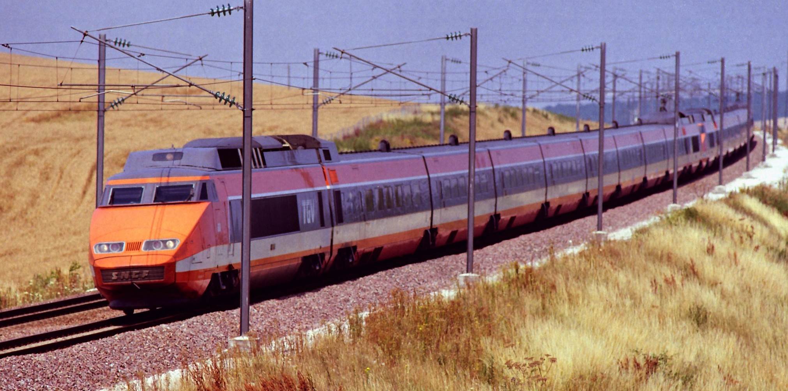
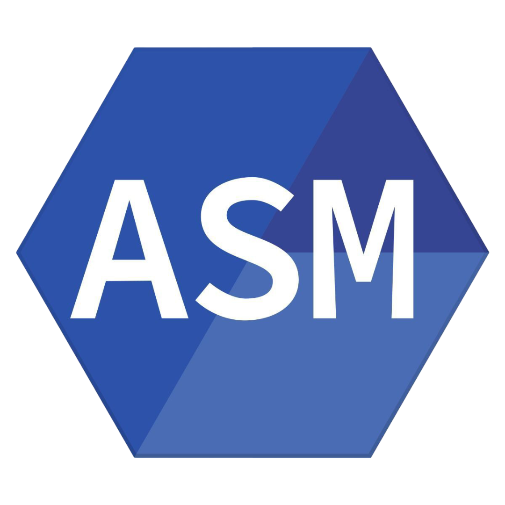

## Bereit zum Auslaufen? Capt-Richelieu am Steuer

  
  

- Student im **BUT Informatik**  
- Ich interessiere mich für die maritime Welt und die Low-Level-Entwicklung.  
- Außerdem entdecke ich gern neue Programmiersprachen und experimentiere mit neuen Ideen.  

🌐 Sprachen:

-  [Französisch](README.md)
-  [Deutsch](README.de.md)
-  [Englisch](README.en.md)

---

## 🔧 Programmiersprachen & Tools

**Programmiersprachen**

	
	
	
	
	

 

**Datenbanken**

	
	

 

**Web**

	
	
	
	
    
	

 

**Tools**

	
	
	
	
	
	
    
	

 

---

## 📂 Meine Projekte

- ⚓ **ws**: Ein in C geschriebener Befehl, inspiriert vom bekannten Befehl `sl`, der Kriegsschiffe erscheinen lässt.
- 🟩 **stork_mod**: Minecraft-Mod für Version 1.21.1 mit dem Thema Elsass.
- 📡 **interpreteur_manipulateur_morse**: In C programmierter Interpreter, der es ermöglicht, mit einem Raspberry Pi und einem 3D-gedruckten Gerät einen Morsetasten-Simulator zu emulieren.
- 🎲 **yams**: Betreutes Erstsemesterprojekt – ein Yams-Spiel in C# mit einer Website, die nach dem Senden der Ergebnisse diese über eine API abruft.
- 🧩 **sudoku_mips32**: Betreutes Erstsemesterprojekt – ein Sudoku-Löser in mips32.

---
