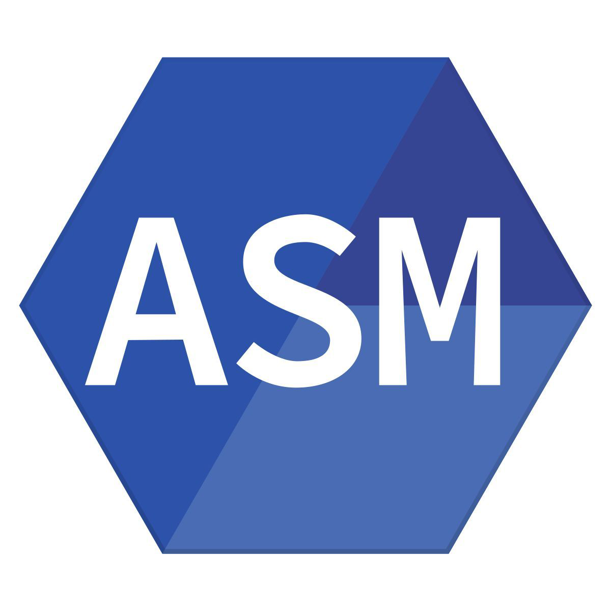

## Hallo 👋, ich bin Capt-Richelieu.

💻 Student im **BUT Informatik**.   
🌱 Interessiert an Low-Level-Programmierung.  
✨ Ich liebe es auch, Programmiersprachen zu entdecken und mit neuen Ideen zu experimentieren.  

🌐 Sprachen:  
- 🇫🇷 [Französisch](README.md)  
- 🇩🇪 [Deutsch](README.de.md)  
- 🇬🇧 [Englisch](README.en.md)

---

## 🔧 Programmiersprachen & Tools

**Langages**

	
	
	
	
	
  	
	

 

**Bases de données**

	
	

 

**Outils**

    
	
	

 

---

## 📂 Meine Projekte
- ⚓ **ws**: Ein in C geschriebener Befehl, inspiriert vom bekannten Befehl `sl`, der Kriegsschiffe erscheinen lässt.  
- 🟩 **stork_mod**: Minecraft-Mod für Version 1.21.1 mit dem Thema Elsass.  
- 📡 **interpreteur_manipulateur_morse**: In C programmierter Interpreter, der es ermöglicht, mit einem Raspberry Pi und einem 3D-gedruckten Gerät einen Morsetasten-Simulator zu emulieren.  
- 🎲 **yams**: Betreutes Erstsemesterprojekt – ein Yams-Spiel in C# mit einer Website, die nach dem Senden der Ergebnisse diese über eine API abruft.  
- 🧩 **sudoku_mips32**: Betreutes Erstsemesterprojekt – ein Sudoku-Löser in mips32.

---