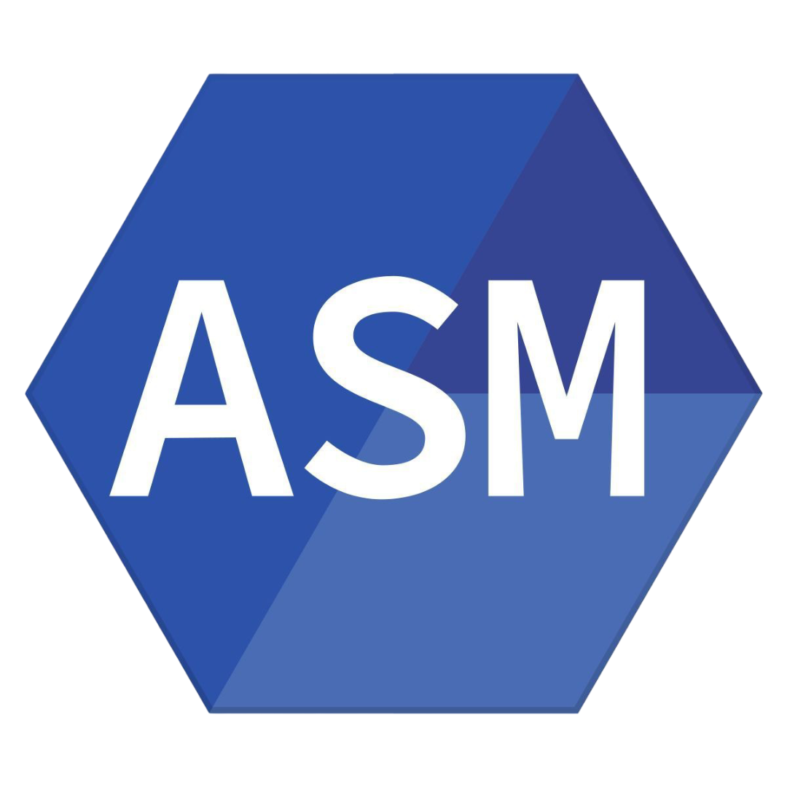

## Hi there 👋, I'm Capt-Richelieu

💻 Student in **Computer Science (BUT Informatique)**  
🌱 Interested in low-level development.  
✨ I also enjoy exploring programming languages and experimenting with new ideas.  

🌐 Languages:  
- 🇫🇷 [French](README.md)  
- 🇩🇪 [German](README.de.md)  
- 🇬🇧 [English](README.en.md)

---

## 🔧 Languages & Tools

**Langages**

	
	
	
	
	
  	
	

 

**Bases de données**

    
	
	

 

**Outils**

	
	

 

---

## 📂 My Projects
- ⚓ **ws**: C command inspired by the famous `sl` command, but featuring warships.  
- 🟩 **stork_mod**: A Minecraft 1.21.1 mod centered around the Alsace region.  
- 📡 **interpreteur_manipulateur_morse**: A C-written interpreter emulating a Morse key using a Raspberry Pi and a 3D-printed device.  
- 🎲 **yams**: First-year guided project – a Yams game in C# with a website that fetches results via an API after submission.  
- 🧩 **sudoku_mips32**: First-year guided project – a Sudoku solver in MIPS32.  

---
